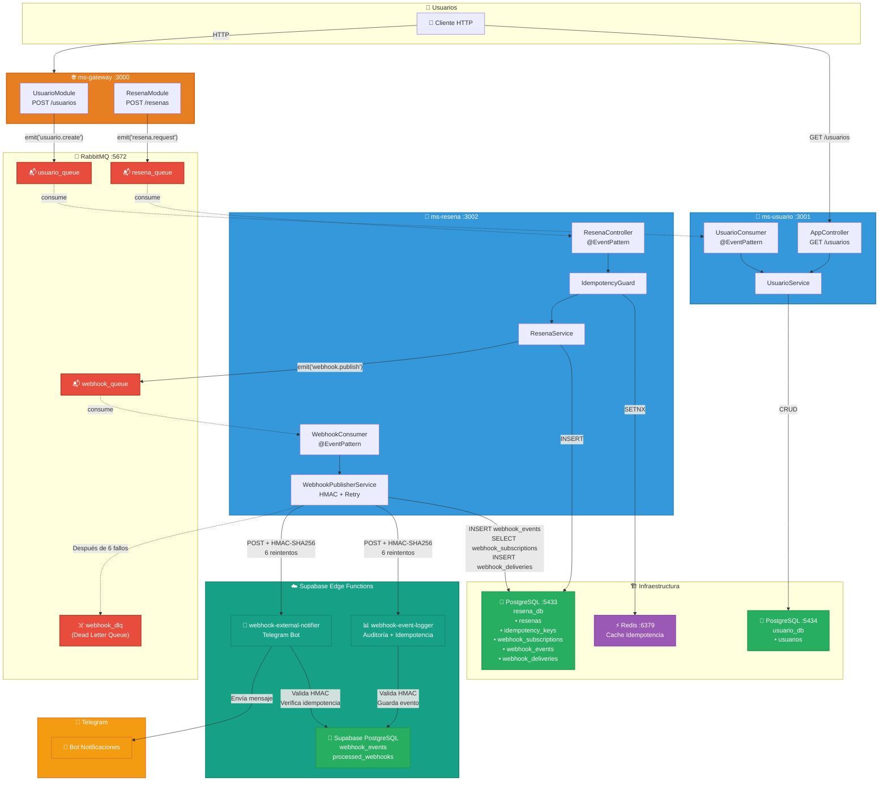

# Sistema de Gestión de Usuarios y Reseñas - Arquitectura de Microservicios

## Diagrama de Arquitectura



## 🏗️ Arquitectura

Sistema de microservicios con arquitectura orientada a eventos que gestiona usuarios y reseñas con capacidades de webhooks serverless.

### Componentes

1. **ms-gateway** (Puerto 3000)

   - API Gateway que recibe peticiones HTTP
   - Publica eventos a RabbitMQ
   - Endpoints: `/usuarios`, `/resenas`

2. **ms-usuario** (Puerto 3001)

   - Gestiona operaciones de usuarios
   - Consume eventos de `usuario_queue`
   - Base de datos: `usuario_db`

3. **ms-resena** (Puerto 3002)

   - Gestiona operaciones de reseñas
   - Implementa idempotencia con Redis
   - Publica webhooks a Supabase Edge Functions
   - Base de datos: `resena_db`

4. **RabbitMQ** (Puerto 5672/15672)

   - Mensajería asíncrona
   - Dead Letter Queue para reintentos fallidos

5. **Redis** (Puerto 6379)

   - Cache para idempotencia

6. **Supabase Edge Functions**
   - `webhook-event-logger`: Auditoría
   - `webhook-external-notifier`: Notificaciones Telegram

## 🚀 Instalación

### Prerequisitos

- Node.js 18+
- Docker y Docker Compose
- Supabase CLI

### 1. Levantar infraestructura

```bash
docker-compose up -d
```

### 2. Inicializar bases de datos

```bash
# Conectar a PostgreSQL de reseñas
docker exec -it practica-serverless-postgres_resena-1 psql -U pguser -d resena_db

# Ejecutar schema SQL (ver supabase/setup.sql)
```

### 3. Instalar dependencias de microservicios

```bash
# Gateway
cd ms-gateway
npm install

# Usuario
cd ../ms-usuario
npm install

# Reseña
cd ../ms-resena
npm install
```

### 4. Configurar Supabase

```bash
cd supabase
supabase functions deploy webhook-event-logger
supabase functions deploy webhook-external-notifier
```

## ▶️ Ejecución

```bash
# Terminal 1 - Gateway
cd ms-gateway
npm run start:dev

# Terminal 2 - Usuario
cd ms-usuario
npm run start:dev

# Terminal 3 - Reseña
cd ms-resena
npm run start:dev
```

## 📡 API Endpoints

### Usuarios

```bash
# Crear usuario
POST http://localhost:3000/usuarios
{
  "nombre": "Juan Pérez",
  "correo": "juan@example.com",
  "tipo": "premium",
  "idioma_preferido": "es"
}

# Listar usuarios
GET http://localhost:3001/usuarios
```

### Reseñas

```bash
# Crear reseña
POST http://localhost:3000/resenas
{
  "usuario_id": 1,
  "destino": "Hotel Paradise",
  "mensaje": "Excelente servicio",
  "calificacion": 5
}

# Eventos generados:
# - resena.created
# - resena.low_rating (si calificación ≤ 2)
```

## 🔐 Seguridad

- Firma HMAC-SHA256 en todos los webhooks
- Validación de timestamps (máx. 5 minutos)
- Idempotencia con Redis

## 🔄 Resiliencia

- 6 reintentos con backoff exponencial
- Dead Letter Queue para eventos fallidos
- Duplicación evitada con idempotency keys

## 📊 Monitoreo

- RabbitMQ Management: http://localhost:15672 (guest/guest)
- PostgreSQL logs: `docker-compose logs -f`
- Redis: `docker exec -it practica-serverless-redis-1 redis-cli`

## 🧪 Testing

```bash
# Crear usuario
curl -X POST http://localhost:3000/usuarios \
  -H "Content-Type: application/json" \
  -d '{"nombre":"Test","correo":"test@mail.com"}'

# Crear reseña con calificación baja (dispara webhook)
curl -X POST http://localhost:3000/resenas \
  -H "Content-Type: application/json" \
  -d '{"usuario_id":1,"destino":"Hotel","mensaje":"Malo","calificacion":1}'
```

## 📝 Entidades

### Usuario

- `id`: UUID
- `nombre`: string
- `correo`: string (único)
- `tipo`: string ('estándar' | 'premium')
- `idioma_preferido`: string
- `activo`: boolean

### Reseña

- `id`: UUID
- `usuario_id`: número
- `destino`: string
- `mensaje`: string
- `calificacion`: número (1-5)
- `status`: string ('PENDING' | 'PROCESSED')
