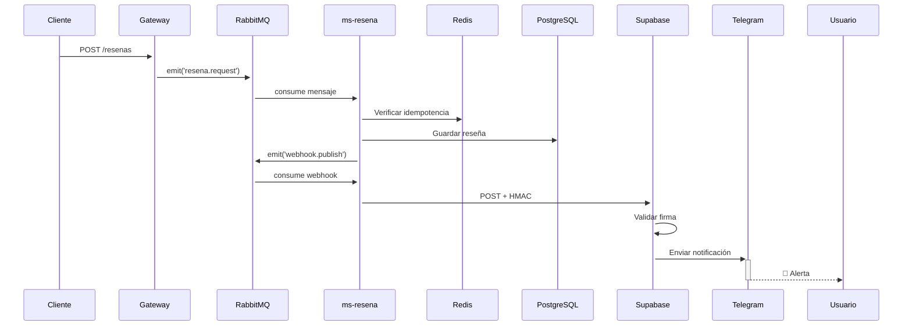

# 🎯 practica-serverless - Resumen Ejecutivo

## ¿Qué es este proyecto?

Sistema de microservicios para gestión de **usuarios y reseñas** con arquitectura orientada a eventos y webhooks serverless. Combina la robustez arquitectónica de **practicaweb-resiliencia** con las entidades de negocio de **webhook-serverless**.

---

## 🏗️ Arquitectura en 3 Capas

### 1️⃣ **API Gateway** (ms-gateway)

- Puerto 3000
- Punto de entrada HTTP
- Publica eventos a RabbitMQ

### 2️⃣ **Microservicios de Negocio**

- **ms-usuario** (puerto 3001): CRUD de usuarios
- **ms-resena** (puerto 3002): CRUD de reseñas + webhooks

### 3️⃣ **Infraestructura**

- RabbitMQ: Mensajería asíncrona
- PostgreSQL: 2 bases de datos separadas
- Redis: Cache para idempotencia
- Supabase: Edge Functions serverless

---

## ✨ Características Principales

### 🔒 Resiliencia

- ✅ Idempotencia con Redis (evita duplicados)
- ✅ 6 reintentos con backoff exponencial
- ✅ Dead Letter Queue para fallos

### 🔐 Seguridad

- ✅ Firma HMAC-SHA256 en webhooks
- ✅ Validación de timestamps
- ✅ Verificación de duplicados

### 📊 Observabilidad

- ✅ Auditoría completa de eventos
- ✅ Registro de entregas exitosas/fallidas
- ✅ Logs estructurados

### 🚨 Alertas Inteligentes

- ✅ Notificaciones a Telegram
- ✅ **Prioridad alta** para reseñas ≤ 2 estrellas
- ✅ Formato personalizado por tipo de evento

---

## 📋 Entidades de Negocio

### Usuario

```typescript
{
  id: UUID;
  nombre: string;
  correo: string(único);
  tipo: "estándar" | "premium";
  idioma_preferido: "es" | "en";
  activo: boolean;
}
```

### Reseña

```typescript
{
  id: UUID;
  usuario_id: number;
  destino: string;
  mensaje: string;
  calificacion: 1 | 2 | 3 | 4 | 5;
  status: "PENDING" | "PROCESSED";
}
```

---

## 🔄 Flujo de Datos



---

## 🎯 Eventos de Webhook

### `resena.created`

**Cuándo:** Calificación ≥ 3  
**Acción:** Notificación estándar a Telegram

### `resena.low_rating`

**Cuándo:** Calificación ≤ 2  
**Acción:** 🚨 **Alerta prioritaria** a Telegram

---

## 🚀 Inicio Rápido

```bash
# 1. Levantar infraestructura
docker-compose up -d

# 2. Instalar dependencias
cd ms-gateway && npm install && cd ..
cd ms-usuario && npm install && cd ..
cd ms-resena && npm install && cd ..

# 3. Iniciar servicios (3 terminales)
cd ms-gateway && npm run start:dev
cd ms-usuario && npm run start:dev
cd ms-resena && npm run start:dev

# 4. Probar sistema
curl -X POST http://localhost:3000/usuarios \
  -H "Content-Type: application/json" \
  -d '{"nombre":"Test","correo":"test@mail.com"}'

curl -X POST http://localhost:3000/resenas \
  -H "Content-Type: application/json" \
  -d '{"usuario_id":1,"destino":"Hotel","mensaje":"Malo","calificacion":1}'
```

---

## 📊 Puertos

| Servicio           | Puerto | Uso                     |
| ------------------ | ------ | ----------------------- |
| ms-gateway         | 3000   | API HTTP                |
| ms-usuario         | 3001   | Consultas usuarios      |
| ms-resena          | 3002   | Consultas reseñas       |
| RabbitMQ           | 5672   | AMQP                    |
| RabbitMQ UI        | 15672  | Dashboard (guest/guest) |
| PostgreSQL Usuario | 5434   | Base de datos           |
| PostgreSQL Reseña  | 5433   | Base de datos           |
| Redis              | 6379   | Cache                   |

---

## 📂 Estructura del Proyecto

```
practica-serverless/
├── ms-gateway/          # API Gateway
├── ms-usuario/          # Microservicio de usuarios
├── ms-resena/           # Microservicio de reseñas + webhooks
├── supabase/            # Edge Functions serverless
│   └── functions/
│       ├── webhook-event-logger/
│       └── webhook-external-notifier/
├── docker-compose.yml   # Infraestructura
├── README.md            # Documentación principal
├── INSTALLATION.md      # Guía paso a paso
├── STRUCTURE.md         # Arquitectura detallada
├── EXAMPLES.md          # Ejemplos de requests
└── COMPARISON.md        # Comparación con otros proyectos
```

---

## 🎓 Tecnologías

### Backend

- **NestJS**: Framework de Node.js
- **TypeORM**: ORM para PostgreSQL
- **RabbitMQ**: Mensajería AMQP
- **Redis**: Cache en memoria
- **Axios**: Cliente HTTP

### Serverless

- **Supabase**: Plataforma BaaS
- **Deno**: Runtime para Edge Functions
- **PostgreSQL**: Base de datos de Supabase

### Infraestructura

- **Docker Compose**: Orquestación de contenedores
- **PostgreSQL 17**: Bases de datos
- **Redis 7**: Cache
- **RabbitMQ 3.11**: Message broker

---

## 🔍 Casos de Uso

### ✅ Ideal para:

- Sistemas de reseñas (hoteles, restaurantes, productos)
- Plataformas de calificaciones
- Aplicaciones con alertas por eventos
- Proyectos que requieren alta resiliencia
- Aprendizaje de arquitectura de microservicios

### ⚠️ No recomendado para:

- Proyectos simples con pocas transacciones
- Aplicaciones que no necesitan webhooks
- Sistemas sin requisitos de escalabilidad

---

## 📈 Escalabilidad

### Horizontal

- ✅ Múltiples instancias de cada microservicio
- ✅ Load balancer en API Gateway
- ✅ RabbitMQ cluster

### Vertical

- ✅ PostgreSQL con replicas de lectura
- ✅ Redis cluster
- ✅ Supabase auto-scaling

---

## 🛠️ Próximos Pasos

1. **Implementar** el sistema localmente
2. **Probar** con diferentes escenarios
3. **Configurar** Telegram para notificaciones
4. **Deploy** a producción (opcional)
5. **Adaptar** a tu dominio de negocio

---

## 📚 Documentación

- [README.md](README.md) - Vista general y diagrama
- [INSTALLATION.md](INSTALLATION.md) - Guía de instalación detallada
- [STRUCTURE.md](STRUCTURE.md) - Arquitectura y estructura
- [EXAMPLES.md](EXAMPLES.md) - Ejemplos de requests HTTP
- [COMPARISON.md](COMPARISON.md) - Comparación con otros proyectos

---

## 🤝 Contribuir

Este es un proyecto educativo. Siéntete libre de:

- Agregar más microservicios
- Implementar nuevas features
- Mejorar la documentación
- Compartir tus adaptaciones

---

## 📞 Soporte

Si tienes dudas:

1. Revisa [INSTALLATION.md](INSTALLATION.md) para troubleshooting
2. Consulta [EXAMPLES.md](EXAMPLES.md) para casos de uso
3. Verifica los logs de Docker: `docker-compose logs -f`

---

## 🎯 Conclusión

**practica-serverless** es un proyecto completo que demuestra:

- ✅ Arquitectura de microservicios profesional
- ✅ Patrones de resiliencia y escalabilidad
- ✅ Integración con servicios serverless
- ✅ Sistema de webhooks robusto
- ✅ Código limpio y bien documentado

¡Perfecto para aprender, adaptar y llevar a producción! 🚀
